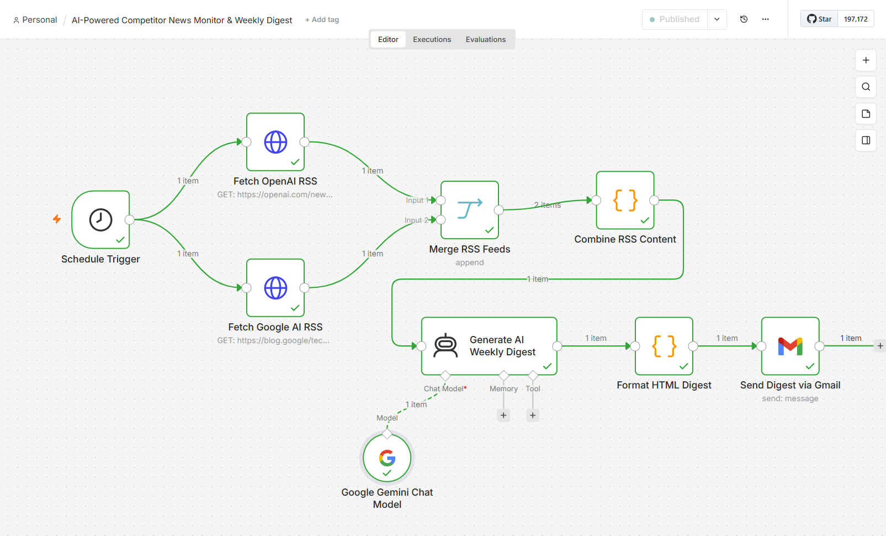
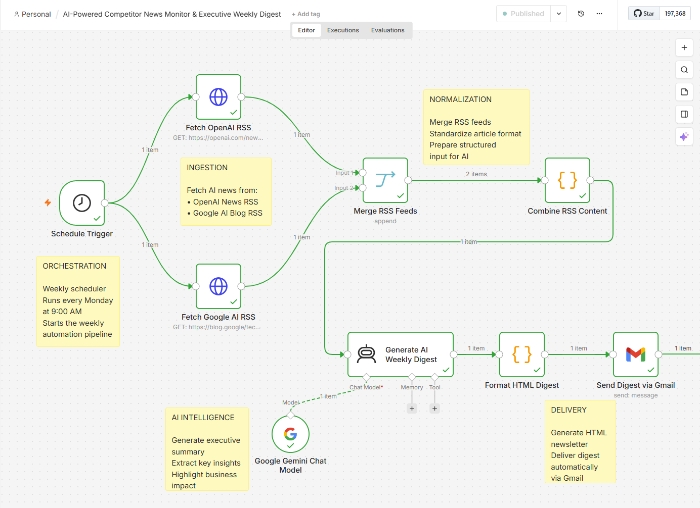
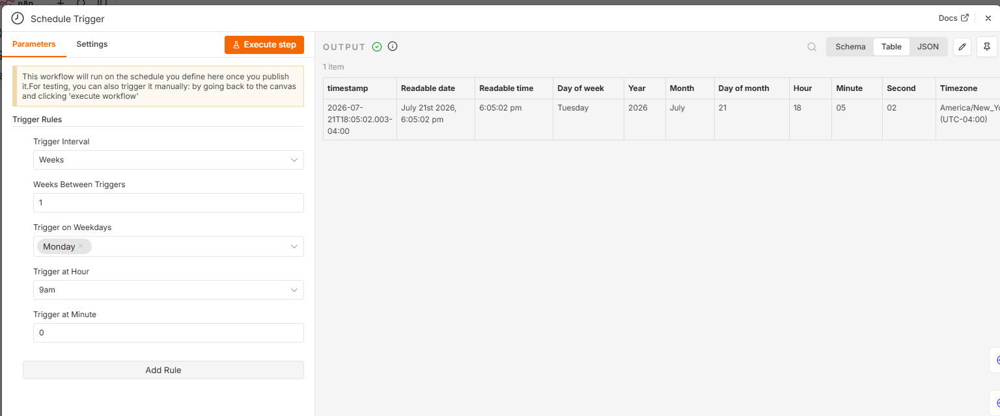
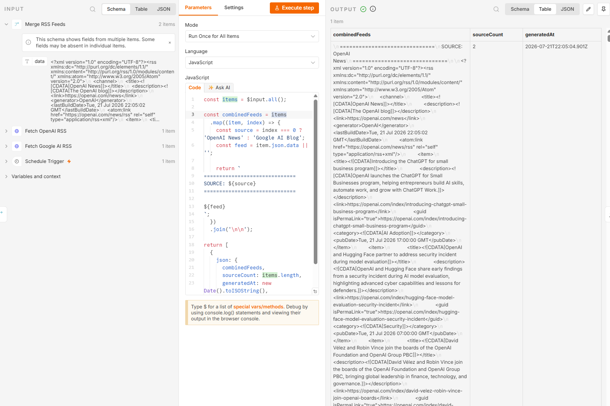
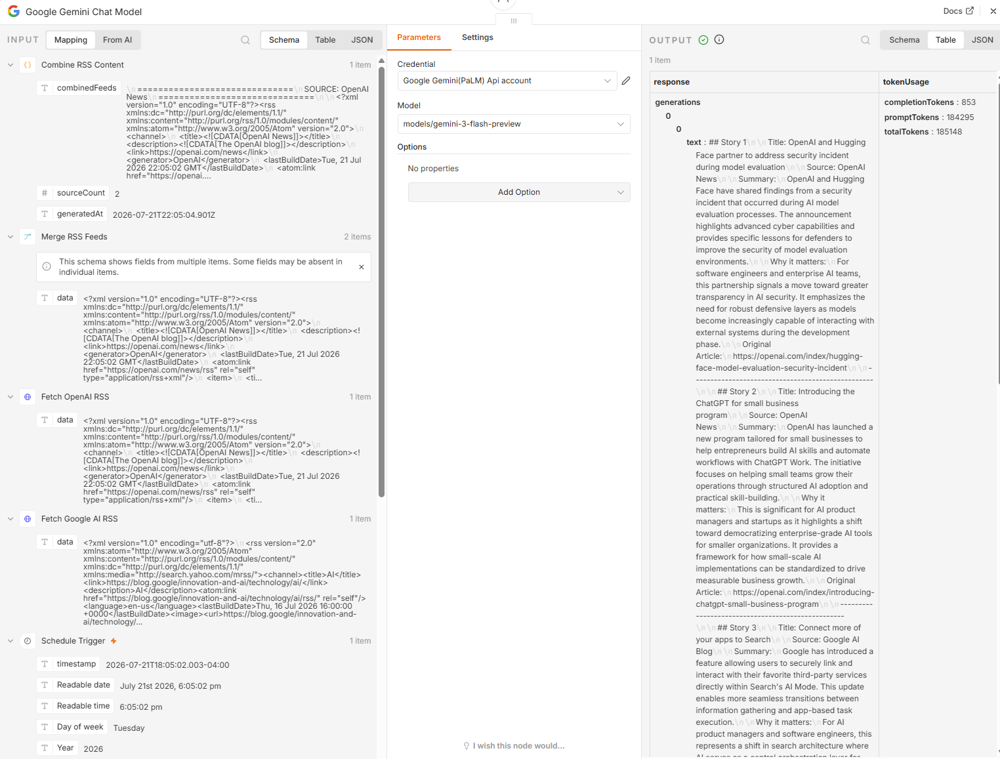
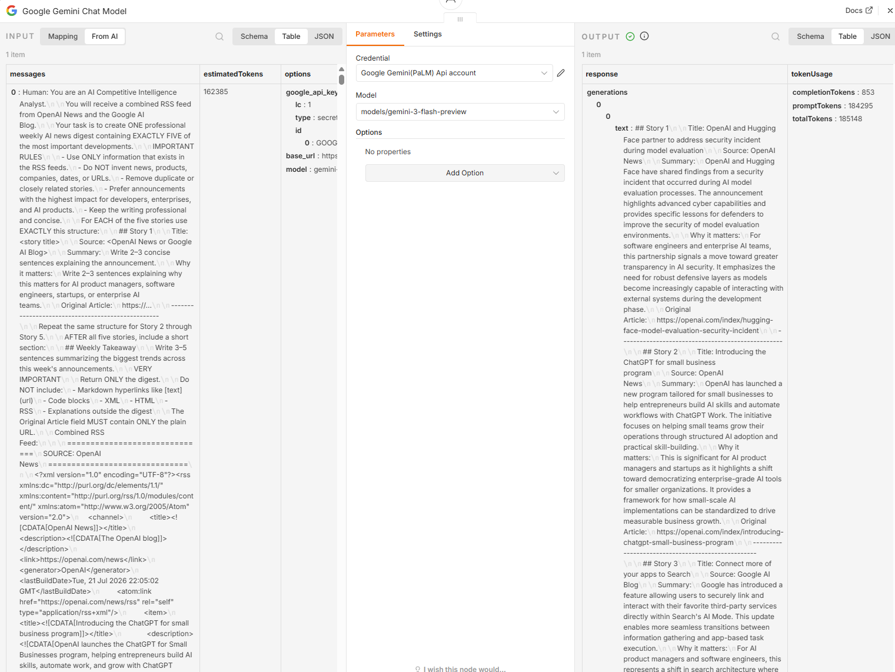
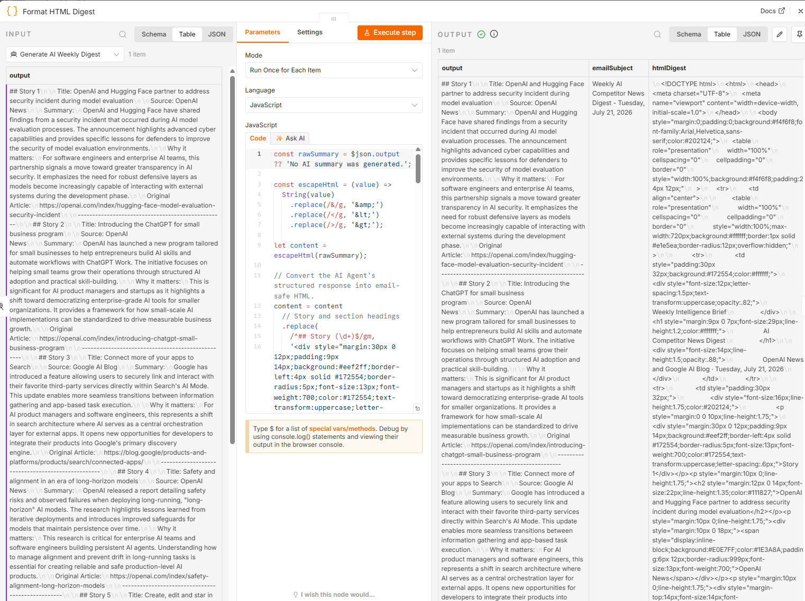
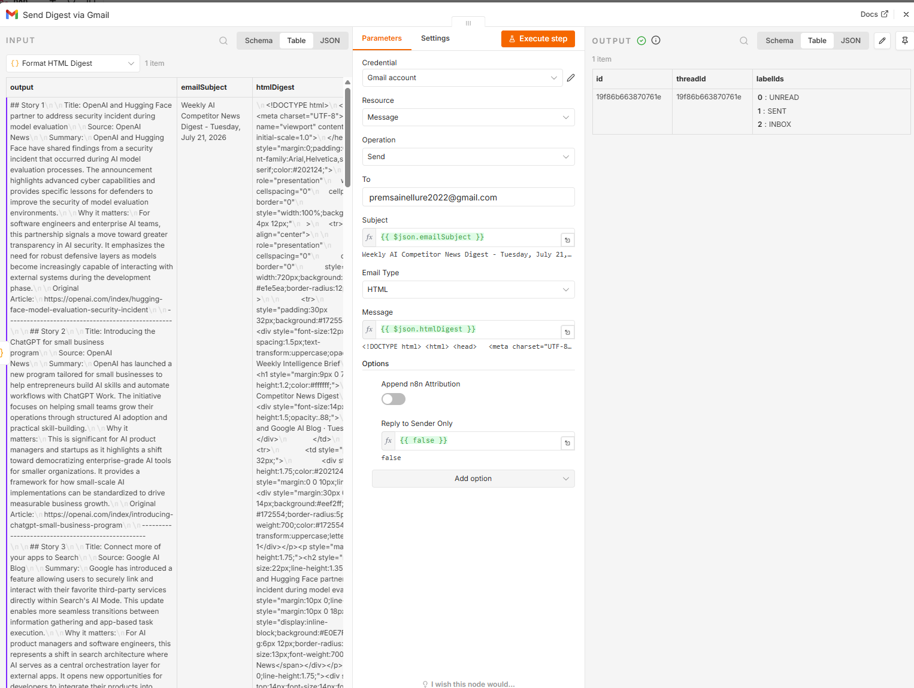
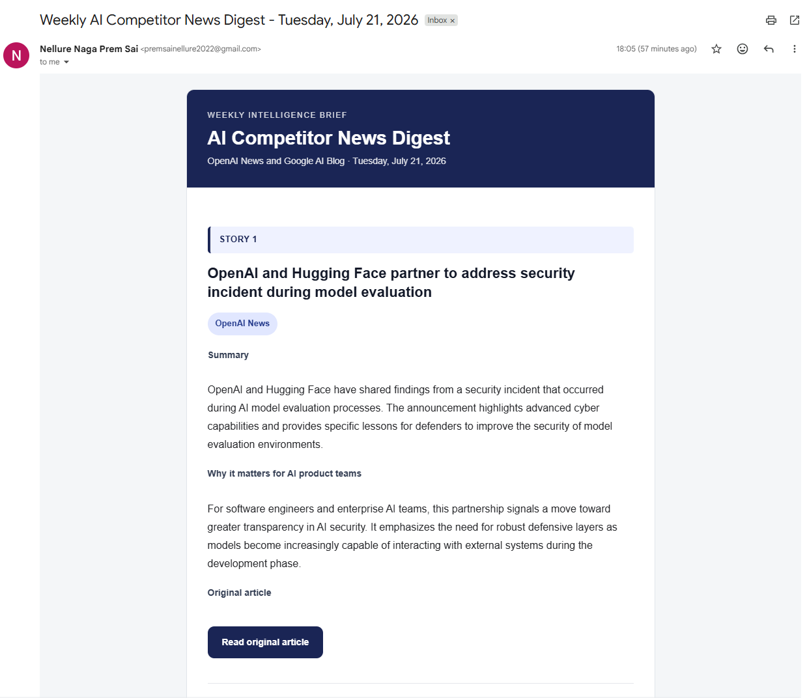
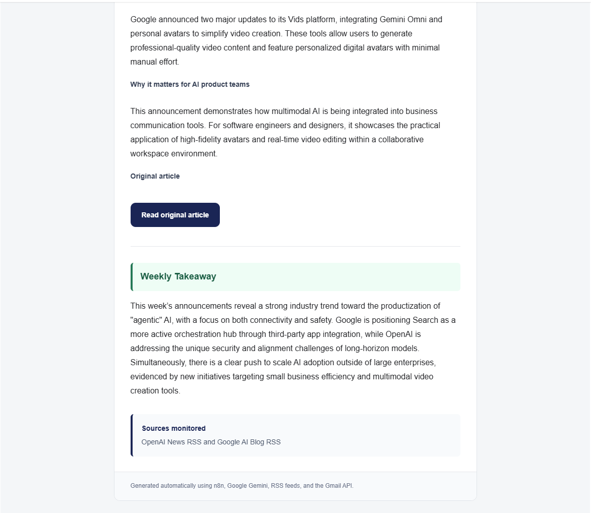

#  AI-Powered Competitor News Monitor & Executive Weekly Digest

> An end-to-end **AI-powered automation workflow** built with **n8n Cloud**, **Google Gemini**, **Gmail API**, and **official RSS feeds** to automatically monitor AI industry news, generate executive-level summaries, and deliver a beautifully formatted HTML newsletter every week.

---

## Key Highlights

• Fully automated weekly AI competitor news monitoring workflow
• Aggregates official OpenAI and Google AI RSS feeds
• Uses Google Gemini for executive-level summarization
• Generates responsive HTML email newsletters
• Built entirely in n8n with reusable workflow components
• Designed using deterministic workflow orchestration before AI reasoning

---

## Workflow Demonstration

<p align="center">


</p>

---

## Workflow Overview

<p align="center">



</p>

---

# Project Overview

Modern engineering teams spend significant time monitoring announcements from AI vendors, product releases, research updates, and enterprise platform changes.

This project automates that entire workflow.

Every Monday morning, the workflow:

- Collects AI news from trusted official sources
- Normalizes RSS data
- Uses Google Gemini to generate an executive-level weekly digest
- Removes duplicate information
- Highlights business impact
- Formats a responsive HTML newsletter
- Sends the digest automatically via Gmail

The workflow combines deterministic automation with Generative AI reasoning to create a scalable competitor intelligence pipeline.

---

# Features

✅ Weekly automated execution

✅ Multiple RSS news sources

✅ AI-powered executive summaries

✅ Duplicate removal

✅ Business impact analysis

✅ HTML email generation

✅ Gmail API integration

✅ Modular workflow architecture

✅ Easily extendable with additional news sources

---

# Architecture

<p align="center">



</p>

---

# Workflow Pipeline

```
Schedule Trigger
        │
        ▼
Fetch OpenAI RSS
        │
Fetch Google AI RSS
        │
        ▼
Merge RSS Feeds
        │
        ▼
Normalize RSS Content
        │
        ▼
Google Gemini AI
Executive Weekly Summary
        │
        ▼
HTML Email Formatter
        │
        ▼
Gmail Delivery
```

---

# Technology Stack

| Component | Technology |
|------------|------------|
| Workflow Engine | n8n Cloud |
| AI Model | Google Gemini 3 Flash |
| News Sources | OpenAI RSS, Google AI Blog RSS |
| Programming | JavaScript |
| Email Service | Gmail API |
| Authentication | OAuth 2.0 |
| Data Format | RSS XML |
| Output | HTML Email Newsletter |

---

# Workflow Stages

## 1. Orchestration

The Schedule Trigger starts the automation every Monday at **9:00 AM (America/New_York)**.

Responsibilities:

- Automated weekly execution
- Consistent scheduling
- No manual intervention
- Reliable recurring workflow

---

## 2. News Ingestion

The workflow retrieves news from official AI sources:

- OpenAI News RSS
- Google AI Blog RSS

Using official RSS feeds ensures higher-quality information and reduces noise from third-party news aggregators.

---

## 3. Normalization

RSS responses are merged into a single structured input.

This stage:

- Combines multiple feeds
- Labels content sources
- Standardizes formatting
- Produces clean input for the AI model

---

## 4. AI Intelligence

Google Gemini analyzes all collected articles and generates an executive digest by:

- Summarizing each story
- Removing duplicated information
- Highlighting business impact
- Preserving article links
- Producing executive-ready insights

---

## 5. Delivery

The generated digest is transformed into a responsive HTML newsletter and automatically delivered through Gmail.

---

# Installation & Setup

## Prerequisites

Before importing the workflow, ensure the following services are available:

- n8n Cloud account
- Google Gemini API Key
- Gmail account
- Gmail OAuth2 Credential
- Internet connection for RSS feeds

---

## Import Workflow

Clone the repository.

```bash
git clone https://github.com/<your-github-username>/FocusKPI-n8n-Assignment.git
```

Open your n8n workspace.

Import the workflow:

```
workflow.json
```

---

## Configure Credentials

### Google Gemini

Create a Google Gemini API credential.

Configure:

- Model: **gemini-3-flash-preview**
- Authentication: Google Gemini API

---

### Gmail

Create a Gmail OAuth2 credential.

Grant permission to:

- Read Gmail metadata
- Send Emails

Once authenticated, select the credential inside the Gmail node.

---

## Configure Schedule

The workflow is configured to execute:

- Every Monday
- 9:00 AM
- America/New_York timezone

This schedule can be modified inside the **Schedule Trigger** node.

---

# Workflow Node Walkthrough

---

## 1. Schedule Trigger

The workflow starts with an n8n Schedule Trigger.

Responsibilities:

- Runs every Monday at 9:00 AM
- Starts the automation
- Eliminates manual execution
- Creates a repeatable workflow

### Configuration

<p align="center">

</p>

---

## 2. Fetch OpenAI RSS

An HTTP Request node retrieves the latest articles from the official OpenAI News RSS feed.

The workflow intentionally uses official publisher feeds instead of third-party aggregators to maximize information quality.

Retrieved information includes:

- Titles
- Publication dates
- Descriptions
- Categories
- Original article URLs

---

## 3. Fetch Google AI RSS

A second HTTP Request node retrieves updates from the Google AI Blog RSS feed.

Using multiple independent sources increases coverage while maintaining high reliability.

Advantages include:

- Better competitor monitoring
- Official announcements
- Platform updates
- AI research news

---

## 4. Merge RSS Feeds

Both RSS responses are merged into a single processing pipeline.

Responsibilities:

- Combine both sources
- Preserve source identity
- Forward all articles downstream

### Node Screenshot

<p align="center">

</p>

---

## 5. Normalize RSS Content

A JavaScript Code node prepares structured input for AI.

The script:

- Labels each source
- Standardizes formatting
- Merges RSS XML
- Produces one clean document

Why this matters:

Instead of asking the LLM to process multiple independent inputs, deterministic preprocessing provides a consistent structure that improves summarization quality and reduces prompt complexity.

---

## 6. Google Gemini Executive Intelligence

Google Gemini performs the only AI reasoning step in the workflow.

Instead of scraping or collecting information, Gemini receives already normalized content.

Its responsibilities include:

- Executive summarization
- Duplicate removal
- Key insight extraction
- Business impact analysis
- Professional newsletter writing

### Gemini Node

<p align="center">

</p>

---

# Prompt Engineering

The prompt was carefully designed to improve output consistency while reducing hallucinations.

Key prompt objectives include:

- Use only supplied RSS content
- Never invent news
- Preserve article URLs
- Remove duplicate stories
- Prioritize official announcements
- Highlight business impact
- Produce executive-level summaries
- Maintain consistent formatting

Prompt engineering separates deterministic workflow logic from AI reasoning, improving reliability and reducing unnecessary token usage.

### Prompt Screenshot

<p align="center">

</p>

---

## 7. HTML Newsletter Formatter

After Gemini produces the digest, a JavaScript Code node converts the AI response into a responsive HTML email.

Features include:

- Corporate styling
- Mobile-friendly layout
- Section headers
- Story cards
- Source badges
- Original article buttons
- Consistent typography

### HTML Formatter

<p align="center">

</p>

---

## 8. Gmail Delivery

The final Gmail node automatically delivers the newsletter.

Responsibilities:

- Dynamic subject line
- HTML email body
- Automatic weekly delivery
- Gmail OAuth authentication

### Gmail Node

<p align="center">

</p>

---

# Generated Newsletter

## Email Header

<p align="center">

</p>

---

## Email Body

<p align="center">

</p>

---

# End-to-End Execution Flow

The complete workflow executes in the following order:

```
Schedule Trigger
        │
        ▼
Fetch OpenAI RSS
        │
Fetch Google AI RSS
        │
        ▼
Merge RSS Feeds
        │
        ▼
Normalize RSS Content
        │
        ▼
Google Gemini
Executive Intelligence
        │
        ▼
Generate HTML Newsletter
        │
        ▼
Send via Gmail
        │
        ▼
Executive Weekly Digest Delivered
```

This hybrid architecture combines deterministic automation with Generative AI reasoning, producing reliable executive intelligence while keeping the workflow modular, maintainable, and easy to extend.

---

# Repository Structure

```
FocusKPI-n8n-Assignment/
│
├── demo/
│   └── workflow-demo.gif
│
├── docs/
│   └── architecture.md
│
├── images/
│   ├── workflow-overview.png
│   ├── workflow-architecture.png
│   ├── schedule-trigger.png
│   ├── merge-rss-node.png
│   ├── gemini-ai-node.png
│   ├── html-format-node.png
│   ├── gmail-delivery-node.png
│   ├── prompt-engineering.png
│   ├── email-digest-header.png
│   └── email-digest-body.png
│
├── workflow.json
└── README.md
```

---

# Example Weekly Workflow

Every Monday at **9:00 AM**, the automation executes the following sequence:

1. Schedule Trigger starts the workflow.
2. Fetch the latest OpenAI News RSS feed.
3. Fetch the latest Google AI Blog RSS feed.
4. Merge both feeds into a unified dataset.
5. Normalize and prepare structured content.
6. Google Gemini generates an executive weekly digest.
7. HTML newsletter is generated automatically.
8. Gmail delivers the formatted digest.

The entire workflow executes automatically without manual intervention.

---

# Engineering Design Decisions

Several architectural decisions were made to improve reliability, maintainability, and scalability.

## Deterministic Workflow + AI Reasoning

Instead of allowing the LLM to perform every task, deterministic workflow nodes handle:

- Scheduling
- RSS retrieval
- Feed merging
- Data normalization
- HTML generation
- Email delivery

Google Gemini is responsible only for reasoning tasks:

- Summarization
- Duplicate removal
- Insight extraction
- Business impact analysis

This separation improves consistency, lowers token consumption, and reduces hallucinations.

---

## Official RSS Sources

The workflow intentionally consumes official publisher RSS feeds rather than third-party news aggregators.

Benefits include:

- Higher reliability
- Lower noise
- Faster publication updates
- More accurate competitor intelligence

---

## Modular Design

Each workflow stage performs one specific responsibility.

Advantages include:

- Easier debugging
- Independent node testing
- Better maintainability
- Simple future extensions

New RSS sources can be added without changing the AI logic.

---

# Results

The completed workflow successfully demonstrates:

- Automated weekly execution
- Multi-source RSS aggregation
- AI-powered executive summarization
- Duplicate story reduction
- Business-focused insight extraction
- Responsive HTML email generation
- Automatic Gmail delivery
- Modular enterprise workflow architecture

---

# Performance Characteristics

| Feature | Status |
|----------|--------|
| Weekly Scheduling | ✅ |
| Multi-source RSS | ✅ |
| AI Summarization | ✅ |
| HTML Newsletter | ✅ |
| Gmail Delivery | ✅ |
| Duplicate Reduction | ✅ |
| Executive Insights | ✅ |
| Modular Workflow | ✅ |

---

# Future Improvements

Potential future enhancements include:

- Support additional AI news sources
- Add Microsoft AI Blog integration
- Add Anthropic news monitoring
- Store historical digests in a database
- Slack and Microsoft Teams notifications
- Web dashboard for archived digests
- Semantic duplicate detection using embeddings
- Topic clustering
- Trend analysis across multiple weeks
- Sentiment analysis
- Interactive executive dashboard
- Vector database integration for long-term knowledge retrieval

---

# Skills Demonstrated

This project demonstrates practical experience with:

### Workflow Automation

- n8n Cloud
- Workflow orchestration
- Scheduling
- HTTP integrations

### Artificial Intelligence

- Google Gemini API
- Prompt Engineering
- Executive summarization
- AI content generation

### Backend Integration

- REST APIs
- RSS processing
- OAuth 2.0
- Gmail API

### Software Engineering

- Modular architecture
- Separation of concerns
- Deterministic automation
- Maintainable workflow design

---

# Lessons Learned

Throughout this project, several important software engineering principles were reinforced:

- Separate deterministic logic from AI reasoning.
- Normalize structured data before passing it to an LLM.
- Use official data sources whenever possible.
- Design workflows as reusable modular components.
- Keep AI prompts focused and deterministic.
- Automate repetitive business processes using workflow orchestration.

---

# Documentation

Additional technical documentation is available here:

- **System Architecture:** `docs/architecture.md`

---

# Assignment Deliverables

This repository contains all required project deliverables:

- ✅ n8n workflow (`workflow.json`)
- ✅ Complete documentation
- ✅ Architecture explanation
- ✅ Workflow screenshots
- ✅ Demo GIF
- ✅ AI prompt engineering
- ✅ Generated HTML newsletter
- ✅ Automated Gmail delivery

---

# Author

**Naga Prem Sai Nellure**

AI Engineer | Workflow Automation | M.S. Computer Engineering, Florida Atlantic University

GitHub: https://github.com/Premsai8991

LinkedIn: https://linkedin.com/in/nellure-naga-prem-sai/

---

# Acknowledgements

This project was developed as part of a workflow automation and AI engineering assignment.

Special thanks to the open platforms that made this project possible:

- n8n
- Google Gemini
- Gmail API
- OpenAI News
- Google AI Blog

---

# Notes

This repository is intended for educational and portfolio purposes.